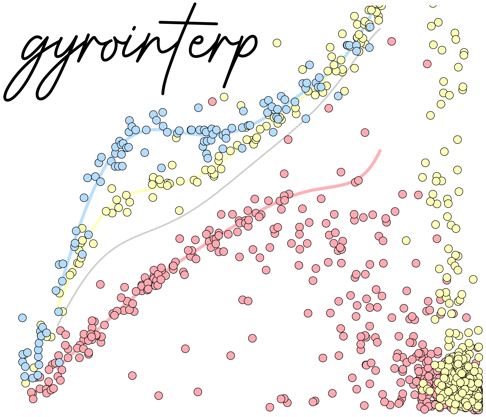

<p align="center"></p>

[](https://gyro-interp.readthedocs.io/en/latest/index.html) 

## Purpose
Observations have shown that stars with the same age and mass can have a wide
range of rotation periods.  The purpose of this code is to compute the
posterior probability for a star's age given its observed rotation period and
effective temperature.  This is achieved by marginalizing over all possible
ages that might explain the observed stellar properties with a parametric
model that has been fitted to not only the mean rotation periods, but also the
intrinsic scatter in observed open cluster rotation sequences.

## Documentation

The documentation is hosted at
[gyro-interp.readthedocs.io](https://gyro-interp.readthedocs.io/en/latest/index.html).
A minimal example to get you started is below.
The method is described in detail in [Bouma, Palumbo & Hillenbrand (2023)](https://ui.adsabs.harvard.edu/abs/2023ApJ...947L...3B/abstract).


## Install
Preferred installation method is through PyPI:
```shell
pip install gyrointerp
```

## Minimal Examples
Given a star's rotation period, effective temperature, and uncertainties, what
is the gyrochronological age posterior over a grid spanning 0 to 2.6 Gyr?

```python
  import numpy as np
  from gyrointerp import gyro_age_posterior

  # units: days
  Prot, Prot_err = 11, 0.2

  # units: kelvin
  Teff, Teff_err = 4500, 100

  # uniformly spaced grid between 0 and 2600 megayears
  age_grid = np.linspace(0, 2600, 500)

  # calculate the age posterior - takes ~30 seconds
  age_posterior = gyro_age_posterior(
      Prot, Teff, Prot_err=Prot_err, Teff_err=Teff_err, age_grid=age_grid
  )

  # calculate dictionary of summary statistics
  from gyrointerp import get_summary_statistics
  result = get_summary_statistics(age_grid, age_posterior)

  print(f"Age = {result['median']} +{result['+1sigma']} -{result['-1sigma']} Myr.")
```

If you were interested in a slower-rotating star that might be closer to 4 Gyr
old, which is the oldest age out to which `gyro-interp` is calibrated, you
could modify the following lines:
```python
  age_grid = np.linspace(0, 5000, 500)

  age_posterior = gyro_age_posterior(
      Prot, Teff, Prot_err=Prot_err, Teff_err=Teff_err, age_grid=age_grid, 
      verbose=False, bounds_error='4gyrextrap'
  )
```

⚠️  Please do not use this code to try to infer ages of stars older than 4 Gyr.
This is gyrochronology by interpolation.  The extrapolation model invoked by
using `bounds_error='4gyrextrap'` has no physical content beyond 4 Gyr.

[The documentation](https://gyro-interp.readthedocs.io/en/latest/index.html)
contains more extensive examples, as well as discussion of important caveats.


## Attribution

If you use the code in your work, please reference
```
@ARTICLE{2023ApJ...947L...3B,
       author = {{Bouma}, Luke G. and {Palumbo}, Elsa K. and {Hillenbrand}, Lynne A.},
        title = "{The Empirical Limits of Gyrochronology}",
      journal = {\apjl},
     keywords = {Stellar ages, Stellar rotation, Field stars, Bayesian statistics, 1581, 1629, 2103, 1900, Astrophysics - Solar and Stellar Astrophysics, Astrophysics - Instrumentation and Methods for Astrophysics},
         year = 2023,
        month = apr,
       volume = {947},
       number = {1},
          eid = {L3},
        pages = {L3},
          doi = {10.3847/2041-8213/acc589},
archivePrefix = {arXiv},
       eprint = {2303.08830},
 primaryClass = {astro-ph.SR},
       adsurl = {https://ui.adsabs.harvard.edu/abs/2023ApJ...947L...3B},
      adsnote = {Provided by the SAO/NASA Astrophysics Data System}
}
```

If your result is particularly dependent on the rotation data from any
one cluster, we also encourage you to refer to the relevant study:

* α Per: [Boyle & Bouma (2023)](https://ui.adsabs.harvard.edu/abs/2022arXiv221109822B/abstract)
* Pleiades: [Rebull et al. (2016)](https://ui.adsabs.harvard.edu/abs/2016AJ....152..113R/abstract)
* Blanco-1: [Gillen et al. (2020)](https://ui.adsabs.harvard.edu/abs/2020MNRAS.492.1008G/abstract)
* Psc-Eri: [Curtis et al. (2019a)](https://ui.adsabs.harvard.edu/abs/2019AJ....158...77C/abstract)
* NGC-3532: [Fritzewski et al. (2022)](https://ui.adsabs.harvard.edu/abs/2021A%26A...652A..60F/abstract)
* Group-X: [Messina et al. (2022)](https://ui.adsabs.harvard.edu/abs/2022A%26A...657L...3M/abstract)
* Praesepe: [Rampalli et al. (2021)](https://ui.adsabs.harvard.edu/abs/2021ApJ...921..167R/abstract)
* NGC-6811: [Curtis et al. (2019b)](https://ui.adsabs.harvard.edu/abs/2019ApJ...879...49C/abstract)
* NGC-6819: [Meibom et al. (2015)](https://ui.adsabs.harvard.edu/abs/2015Natur.517..589M/abstract)
* Ruprecht-147 [Curtis et al. (2020)](https://ui.adsabs.harvard.edu/abs/2020ApJ...904..140C/abstract)
* M67: [Barnes et al. (2016)](https://ui.adsabs.harvard.edu/abs/2016ApJ...823...16B/abstract), [Dungee et al (2022)](https://ui.adsabs.harvard.edu/abs/2022ApJ...938..118D/abstract), and [Gruner et al (2023)](https://ui.adsabs.harvard.edu/abs/2023A%26A...672A.159G/abstract).
