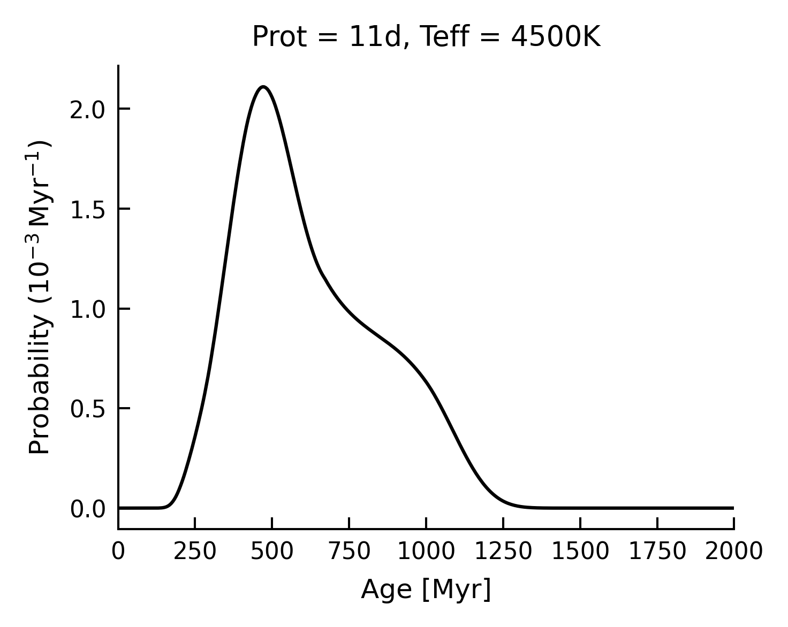
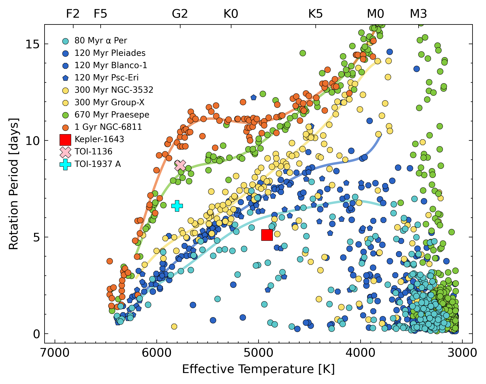

Examples
========================================

Rotation-based age for one star
++++++++++++++++++++++++++++++++++++++++

Given a single star's rotation period, effective temperature, and
uncertainties, what is the rotation-based age posterior over a grid spanning 0
to 2.6 Gyr?

.. code-block:: python

  import numpy as np
  from gyrointerp import gyro_age_posterior

  # units: days
  Prot, Prot_err = 11, 0.2

  # units: kelvin
  Teff, Teff_err = 4500, 100

  # uniformly spaced grid between 0 and 2600 megayears
  age_grid = np.linspace(0, 2600, 500)

  # calculate the age posterior at each age in `age_grid`
  age_posterior = gyro_age_posterior(
      Prot, Teff,
      Prot_err=Prot_err, Teff_err=Teff_err,
      age_grid=age_grid
  )

This takes about 30 seconds to run on my laptop.  You can then use a helper
function to calculate summary statistics of interest:

.. code-block:: python

  # calculate dictionary of summary statistics
  from gyrointerp import get_summary_statistics
  result = get_summary_statistics(age_grid, age_posterior)

  print(f"Age = {result['median']} +{result['+1sigma']} -{result['-1sigma']} Myr.")

You can also plot the posterior using matplotlib:

.. code-block:: python

  import matplotlib.pyplot as plt

  fig, ax = plt.subplots()
  ax.plot(age_grid, 1e3*age_posterior, c='k', lw=1)
  ax.update({
      'xlabel': 'Age [Myr]',
      'ylabel': 'Probability ($10^{-3}\,$Myr$^{-1}$)',
      'title': f'Prot = {Prot}d, Teff = {Teff}K',
      'xlim': [0,2000]
  })
  plt.show()

.. |br| raw:: html

    

This age posterior is highly asymmetric because this particular rotation
period and temperature overlap with the era of "`stalled spin-down
<https://ui.adsabs.harvard.edu/abs/2020ApJ...904..140C/abstract>`_".

Age for an older star
++++++++++++++++++++++++++++++++++++++++
The oldest stars for which ``gyro-interp`` gives well-calibrated results are 
4 Gyr old, which is the age of M67, the oldest calibration cluster.  For a
longer rotation period, you could run

.. code-block:: python

  import numpy as np
  from gyrointerp import gyro_age_posterior

  # units: days
  Prot, Prot_err = 31, 3

  # units: kelvin
  Teff, Teff_err = 5000, 100

  # uniformly spaced grid between 0 and 5000 megayears
  age_grid = np.linspace(0, 5000, 500)

  # calculate the age posterior at each age in `age_grid`
  age_posterior = gyro_age_posterior(
      Prot, Teff,
      Prot_err=Prot_err, Teff_err=Teff_err,
      age_grid=age_grid,
      bounds_error='4gyrextrap'
  )

The above example corresponds to a star that sits near the M67 rotation
sequence (e.g., `Gruner+2023
<https://ui.adsabs.harvard.edu/abs/2023A%26A...672A.159G/abstract>`_).  In this
example, we called the keyword argument ``bounds_error`` and set it to
``'4gyrextrap'``.  For the invested user, the origin of this setting is
discussed in `this documentation note
<https://docs.google.com/document/d/1X_tOf1y1e8yvRZFo7NgPTsOSSR5p2J1wsyb1NT3DDB4/edit?usp=sharing>`_,
and in the `docstrings
<https://gyro-interp.readthedocs.io/en/latest/gyrointerp.html#gyrointerp.gyro_posterior.gyro_age_posterior>`_.
 

Ages for many stars
++++++++++++++++++++++++++++++++++++++++

Given the rotation periods, temperatures, and uncertainties for many stars,
what are the implied age posteriors?

In the example below, we will calculate age posteriors using the
``gyro_age_posterior_list`` function.  We will do this for a number of stars
equal to the number of cores on your computer, so that the runtime should be
roughly the same as for the single-star example above.

.. code-block:: python

  import os
  import numpy as np, pandas as pd
  from gyrointerp import gyro_age_posterior_list, get_summary_statistics

  def main():

      # Define temperatures, periods, and uncertainties for some stars.
      # At >~20 days, assume a few percent relative uncertainty on periods.
      N_stars = os.cpu_count()
      Teffs = np.linspace(4000, 5500, N_stars)
      Teff_errs = 100 * np.ones(N_stars)
      Prots = np.linspace(15, 22, N_stars)
      Prot_errs = 0.03 * Prots

      # The output posteriors will be cached at ~/.gyrointerp_cache/{cache_id}
      cache_id = 'my_awesome_stars'

      # A 5500 K star with Prot = 22 d will be near the Ruprecht-147 sequence.
      # Let's extend the age_grid up to 4000 Myr (4 Gyr); the extrapolation 
      # past 2.6 Gyr will be based on the M67 data.
      age_grid = np.linspace(0, 4000, 500)

      # Let's pass optional star IDs to name the posterior csv files.
      star_ids = [f"FOO{ix}" for ix in range(N_stars)]

      # This function will compute the posteriors, and cache them to CSV files
      csvpaths = gyro_age_posterior_list(
          cache_id, Prots, Teffs, Prot_errs=Prot_errs, Teff_errs=Teff_errs,
          star_ids=star_ids, age_grid=age_grid, bounds_error="4gyrlimit",
          interp_method="pchip_m67"
      )

      # Read the posteriors and print their summary statistics.
      for csvpath, Prot, Teff in zip(sorted(csvpaths), Prots, Teffs):
          df = pd.read_csv(csvpath)
          r = get_summary_statistics(df.age_grid, df.age_post)
          msg = f"Age = {r['median']} +{r['+1sigma']} -{r['-1sigma']} Myr."
          print(f"Teff {int(Teff)} Prot {Prot:.2f} {msg}")

  if __name__ == "__main__":
      main()

In this example we guarded the multiprocessing being executed in
``gyro_age_posterior_list`` in a ``__main__`` block, per the suggestion in the
`multiprocessing docs
<https://docs.python.org/3/library/multiprocessing.html>`_.  This example also
takes about 30 seconds to run on my laptop.  Since this is the same runtime as
the single-star case, this means that the multithreading is doing what we want.

.. _visual interpolation:

Visual interpolation for a star's age
++++++++++++++++++++++++++++++++++++++++
We sometimes might want to examine where a given star falls in the
rotation-temperature plane in comparison to known reference clusters.  If a
star has a rotation period that corresponds to lots of possible ages, we should
be sure that that this expectation is being mirrored in the age posteriors!
Accounting for this type of intrinsic population level scatter is one of the
main goals of the BPH23 model.

In this example, we will compare the rotation periods of a few stars that are
known to have transiting planets against the reference cluster datasets.
To make the plot, let's first install a package to automate the matplotlib
style-setting:

.. code-block:: bash
  
    $ pip install aesthetic

We can then use the ``plot_prot_vs_teff`` function under
``gyrointerp.plotting``:

.. code-block:: python

  from gyrointerp.plotting import plot_prot_vs_teff

  # write the results to the current working directory
  outdir = "./"

  # show these cluster Prot vs Teff datasets
  reference_clusters = [
      'α Per', 'Pleiades', 'Blanco-1', 'Psc-Eri', 'NGC-3532', 'Group-X',
      'Praesepe', 'NGC-6811'
  ]

  # underplot these polynomial fits
  model_ids = [
      'α Per', '120-Myr', '300-Myr', 'Praesepe', 'NGC-6811'
  ]

  # overplot these stars with big markers
  custom_stardict = {
      "Kepler-1643": {"Prot":5.1, "Teff":4916, "m":"s", "c":"red"},
      "TOI-1136": {"Prot":8.7, "Teff":5770, "m":"X", "c":"pink"},
      "TOI-1937 A": {"Prot":6.6, "Teff":5798, "m":"P", "c":"aqua"},
  }

  # make the plot
  plot_prot_vs_teff(
      outdir, reference_clusters=reference_clusters, model_ids=model_ids,
      custom_stardict=custom_stardict, writepdf=0
  )

which yields the following plot:

.. |br| raw:: html

    

Kepler-1643, TOI-1136, and TOI-1937 provide three interestingly different
examples.  Kepler-1643 is `~40 Myr old based on cluster membership
<https://ui.adsabs.harvard.edu/abs/2022AJ....164..215B/abstract>`_, and it
hosts a close-in mini-Neptune around twice the size of Earth.  TOI-1136 is a
`field star with six known transiting planets
<https://arxiv.org/abs/2210.09283>`_, and rotation is currently the most
constraining line of evidence for its ~700 Myr age.  Finally, TOI-1937 is a
system for which gyrochronology should probably not be applied.  The reasons
are that it is `both a known binary
<https://ui.adsabs.harvard.edu/abs/2022arXiv221015473Y/abstract>`_, with a
widely-separated companion, and the primary also hosts a hot Jupiter, which
`might spin up the primary
<https://ui.adsabs.harvard.edu/abs/2021ApJ...919..138T/abstract>`_ through
tides.  This kind of interaction is exactly the kind of thing that we tried to
avoid by cleaning out binaries in BPH23!  While it is in principle possible to
construct models that account for known tidal or other spin-up, the BPH23 model
does not attempt to do this.
