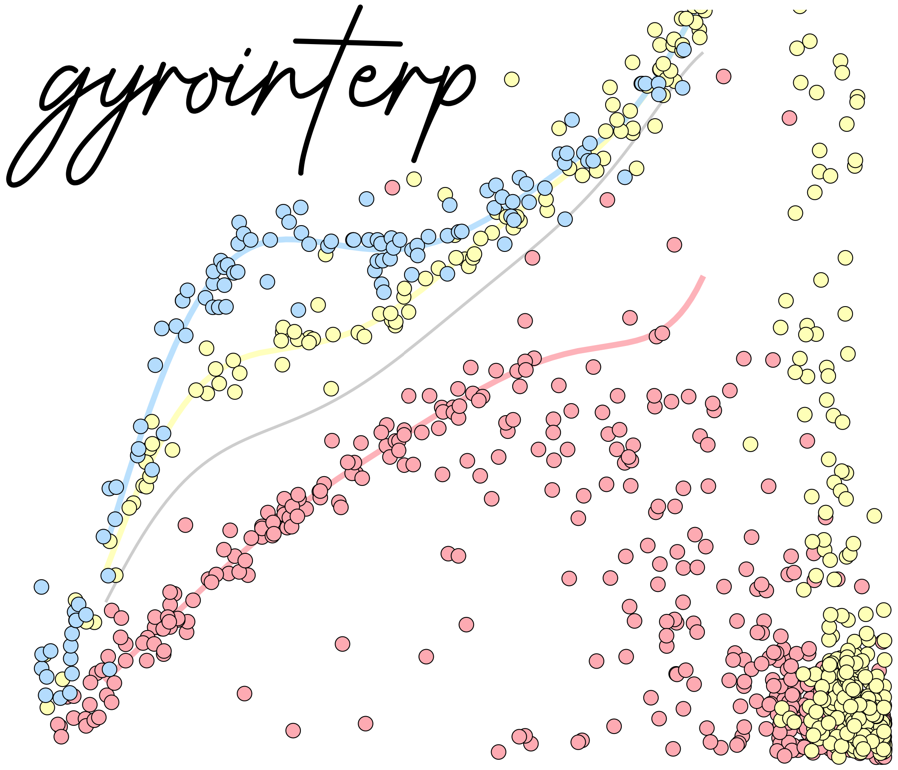

gyro-interp
++++++++++++

Hi!  Welcome to the documentation for ``gyrointerp``, a Python package that
calculates gyrochronal ages by interpolating between open cluster rotation
sequences.

``gyrointerp`` packages the model from `Bouma, Palumbo & Hillenbrand (2023)
<https://ui.adsabs.harvard.edu/abs/2023ApJ...947L...3B>`_ into a fast and easy-to-use framework.
The documentation below will walk you through the most common use-cases.  For
brevity, we'll refer to that paper as BPH23.

This package is designed to meet the needs of working astronomers with
interests in gyrochronal age measurement, and we encourage community
involvement.  If you find a bug or would like to request a feature, please do
create an `issue on Github <https://github.com/lgbouma/gyro-interp>`_. 

.. |br| raw:: html

    

Attribution:
++++++++++++

The reference for both the software and method is `Bouma, Palumbo & Hillenbrand
(2023) <https://ui.adsabs.harvard.edu/abs/2023ApJ...947L...3B>`_.  
The relevant bibtex entry is as follows.

.. code-block:: latex

  @ARTICLE{2023ApJ...947L...3B,
         author = {{Bouma}, Luke G. and {Palumbo}, Elsa K. and {Hillenbrand}, Lynne A.},
          title = "{The Empirical Limits of Gyrochronology}",
        journal = {\apjl},
       keywords = {Stellar ages, Stellar rotation, Field stars, Bayesian statistics, 1581, 1629, 2103, 1900, Astrophysics - Solar and Stellar Astrophysics, Astrophysics - Instrumentation and Methods for Astrophysics},
           year = 2023,
          month = apr,
         volume = {947},
         number = {1},
            eid = {L3},
          pages = {L3},
            doi = {10.3847/2041-8213/acc589},
  archivePrefix = {arXiv},
         eprint = {2303.08830},
   primaryClass = {astro-ph.SR},
         adsurl = {https://ui.adsabs.harvard.edu/abs/2023ApJ...947L...3B},
        adsnote = {Provided by the SAO/NASA Astrophysics Data System}
  }

If your result is particularly dependent on the rotation data from any
one cluster, we also encourage you to refer to the relevant study:

* α Per: `Boyle & Bouma (2023) <https://ui.adsabs.harvard.edu/abs/2022arXiv221109822B/abstract>`_
* Pleiades: `Rebull et al. (2016) <https://ui.adsabs.harvard.edu/abs/2016AJ....152..113R/abstract>`_
* Blanco-1: `Gillen et al. (2020) <https://ui.adsabs.harvard.edu/abs/2020MNRAS.492.1008G/abstract>`_
* Psc-Eri: `Curtis et al. (2019a) <https://ui.adsabs.harvard.edu/abs/2019AJ....158...77C/abstract>`_
* NGC-3532: `Fritzewski et al. (2022) <https://ui.adsabs.harvard.edu/abs/2021A%26A...652A..60F/abstract>`_
* Group-X: `Messina et al. (2022) <https://ui.adsabs.harvard.edu/abs/2022A%26A...657L...3M/abstract>`_
* Praesepe: `Rampalli et al. (2021) <https://ui.adsabs.harvard.edu/abs/2021ApJ...921..167R/abstract>`_
* NGC-6811: `Curtis et al. (2019b) <https://ui.adsabs.harvard.edu/abs/2019ApJ...879...49C/abstract>`_
* NGC-6819: `Meibom et al. (2015) <https://ui.adsabs.harvard.edu/abs/2015Natur.517..589M/abstract>`_
* Ruprecht-147 `Curtis et al. (2020) <https://ui.adsabs.harvard.edu/abs/2020ApJ...904..140C/abstract>`_
* M67: `Barnes et al. (2016) <https://ui.adsabs.harvard.edu/abs/2016ApJ...823...16B/abstract>`_, `Dungee et al (2022) <https://ui.adsabs.harvard.edu/abs/2022ApJ...938..118D/abstract>`_, and `Gruner et al. (2023) <https://ui.adsabs.harvard.edu/abs/2023A%26A...672A.159G/abstract>`_.

User Guide:
++++++++++++

.. toctree::
    :maxdepth: 2
    :caption: Contents:

    installation
    examples
    caveats
    faqs
    gyrointerp

Changelog:
++++++++++

**0.5 (2024-07-17)**

* Make ``helpers.get_summary_statistics`` agnostic to scipy version.
* Clarify `setup.py` dependencies
* Bugfix ReadTheDocs auto-documentation.
* Move `requirements.txt` to `docs/requirements.txt`.

**0.4 (2024-05-30)**

* Add ``bounds_error = '4gyrextrap'`` option for 2.6-4 Gyr extrapolation.  The rationale for this update is documented at `this google doc <https://docs.google.com/document/d/1X_tOf1y1e8yvRZFo7NgPTsOSSR5p2J1wsyb1NT3DDB4/edit?usp=sharing>`_.
* Refactor ``helpers.get_summary_statistics`` for better numerical precision.
* Add Gruner+2023 M67 data.

**0.3 (2023-03-03)**

* Bugfix a ModuleNotFoundError for calls to ``gyrointerp.plotting``
* Add "posterior stacker" and cross-validation drivers.

**0.2 (2023-02-21)**

* Initial software release to PyPI and github.

**0.1 (2023-02-21)**

* Initial software release to github.
